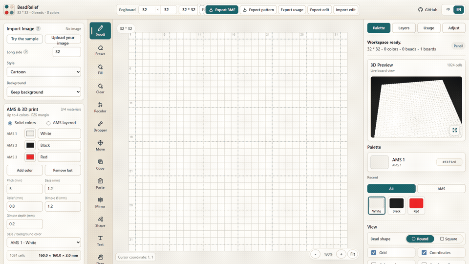

<div align="center">


# BeadRelief

### 图片进来，拼豆出去。

在浏览器本地把任意图片转换为可编辑拼豆图纸或多色 3MF 拼豆浮雕。

[**打开在线演示 →**](https://pgp00.github.io/beadrelief/) · [下载样例 3MF](samples/beadrelief-heart-p2s.3mf) · [English](README.md)

[](https://github.com/pgp00/beadrelief/actions/workflows/deploy.yml)



<sub>优先支持桌面端 · 完整工作区需要至少 980 px 宽的浏览器窗口。</sub>

</div>

## 为什么选择 BeadRelief？

| 🔒 本地处理 | 🧩 可打印拼豆图纸 | 🖨️ 面向 Bambu 的 3MF |
|:---:|:---:|:---:|
| 图片和生成文件都留在浏览器中。 | 使用完整 MARD 色板并导出 PNG/PDF 图纸。 | 包含项目耗材颜色和零件分配。 |

## 选择输出类型

在线演示提供两个明确入口，并共享同一套可编辑画布：

- **拼豆图纸：**使用完整上游工作台，包括基础版/完整版 MARD 色板、全部绘图工具、图层、参考图临摹、图像调整、用量统计、拼豆 3D 预览，以及 PNG/PDF/XLSX/JSON 导出。画布和图片转换最高支持 180 × 180 格，并可使用完整 291 色。
- **3D 打印：**使用最多四种 AMS 颜色转换图片，检查浮雕预览并导出分组 `.3mf`。

打开[在线演示](https://pgp00.github.io/beadrelief/)，选择**拼豆图纸**或 **3D 打印**，然后上传 JPG、PNG 或 WebP 图片。

## 在 Bambu Studio 中打开

1. 导入生成的 `.3mf`。
2. 选择 Bambu Lab P2S 和 `0.4 mm` 喷嘴。
3. 检查文件内的项目耗材颜色和零件分配，将它们映射到实际 AMS 槽位，然后切片并检查颜色预览。

> [!IMPORTANT]
> 仓库中的爱心文件尚未完成实体打印。打印前请务必确认 AMS 槽位映射和切片预览。

## 试试爱心样例

用同一个小爱心走完可编辑项目流程：

| 源文件 | 编辑 | 打印 |
|:---:|:---:|:---:|
| [PNG](samples/beadrelief-heart-source.png) | [项目 JSON](samples/beadrelief-heart-project.json) | [分组 3MF](samples/beadrelief-heart-p2s.3mf) |

## 本地运行

需要 Node.js 22.9 或更高版本。

```bash
npm ci
npm run dev
```

打开 <http://127.0.0.1:5174/>。

<details>
<summary><strong>验证状态</strong></summary>

CI 会重新生成仓库内样例、检查每个 3MF，并验证文件内的项目耗材颜色和零件分配。精确哈希与兼容性记录见 [Bambu Studio 验证](docs/verification/bambu-studio-p2s.md)。

</details>

<details>
<summary><strong>已知限制</strong></summary>

- Solid 模式导出一个分组浮雕；Layered 模式仍处于实验阶段，使用从底到顶的单一全局耗材顺序，不是 Bambu Studio Mixed Filament 元数据。
- 3D 打印模式最多使用四种材料；这些 AMS 和 3MF 限制不适用于拼豆图纸模式。
- 3MF 导出限制为 32 × 32 格。
- 打印前请在 Bambu Studio 中确认实际 AMS 槽位映射。

</details>

<details>
<summary><strong>隐私</strong></summary>

图片处理和生成文件都留在浏览器中，应用不会把它们上传到服务器。当前可编辑草稿可能保存在浏览器本地存储中，直到被替换或清除。

</details>

## 上游与许可

BeadRelief 基于 MIT 许可的 [Jett-Wu/Perler_Beads_Generator](https://github.com/Jett-Wu/Perler_Beads_Generator)。导入的提交和项目改动见 [UPSTREAM.md](UPSTREAM.md)。本仓库采用 [MIT License](LICENSE) 发布。

如果 BeadRelief 帮你做出了作品，点个 GitHub Star 可以帮助更多创作者发现它。欢迎参与贡献，详情见 [CONTRIBUTING.md](CONTRIBUTING.md)。
